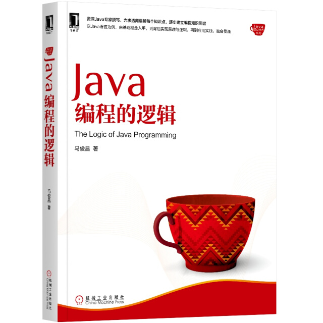

# program-logic

所有文章已整理完善成书，由机械工业出版社华章分社出版，欢迎购买！各大网点有售，京东购买链接：

https://item.jd.com/12299018.html

书中完整代码导航：https://github.com/swiftma/program-logic/blob/master/the_logic_of_java_programming.md
-------------------
微信公众号"老马说编程"中的代码示例，所有示例代码基于JDK 8。

标准Eclipse项目，导入即可，导入后可能需要修改JDK配置。

包结构：

* 基础：shuo.laoma.basic
* 类：shuo.laoma.cls
* 常见类：shuo.laoma.commoncls
* 泛型和容器类：shuo.laoma.collection
* 文件：shuo.laoma.file
* 并发：shuo.laoma.concurrent
* 正则表达式：shuo.laoma.regex
* Java 8新特性：shuo.laoma.java8

QQ交流群：574974775，备注"编程"

微信交流群：先加老马微信 swiftma，备注"编程"

所有文章列表：http://t.im/laoma